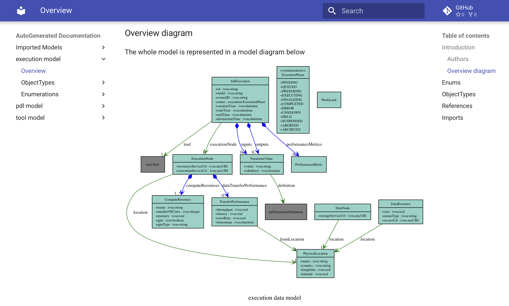

# The Problem

## Moving Compute to Data

- Modern astronomical instruments produce increasingly **large** and **complex** datasets
- Traditional VO approach: move data to compute
- **Better paradigm**: move compute to the data
- Requires interactions between:
  - Job execution servers, brokers, schedulers
  - Data staging & management
  - Resource/Image discovery & matching

:::notes

this is all fairly well known and an accepted paradigm - however what is presented here is not restricted to that exact use case - it works well for other more traditional batch job execution use cases as well - e.g. a user has a script that they want to run on a cluster and be notified when the results are ready.

:::

---

# Vision

## Data-Model-First Approach

A **comprehensive data model** drives:

- Interoperable APIs
- Service definitions
- Efficient resource utilization
- Reduced workflow orchestration effort

**Result**: Scientists focus on science; systems optimize execution.

---

# Heterogeneous Components

## Diverse Ecosystem

- The VO vision is to provide common façades that might have different implementations. 
- Historically the VO has focussed on services with little interconnection
  -  Each service API is defined in isolation. 
- ExecutionDM is designed to be the common data model for a set of interconnected services.
  - this is analogous to how Kubernetes defines a common API and data model for a wide variety of underlying container orchestration services.
- It should even be possible to compose different implementations of the various services (e.g. a job queue from one provider, a scheduler from another, and a resource broker from a third) as long as they all adhere to the same underlying data model.
  -  We have seen how each archive/Science platform has different implementation constraints.

---

# Heritage

ExecutionDM draws inspiration from:

- **[UWS 1.1](https://ivoa.net/documents/UWS/)** — Job lifecycle & asynchronous execution patterns
- **[CEA](https://www.ivoa.net/Documents/Notes/CEA/CEADesignIVOANote-20050513.html)** — Historical AstroGrid common execution architecture concepts
- **[PDL 1.0](https://ivoa.net/documents/PDL/)** — Parameter description language
- **[ExecutionBroker](https://github.com/ivoa-std/ExecutionBroker)** — Distributed platform brokerage (lessons learned/code reuse)
- **[OpenCADC Library Tools](http://www.opencadc.org/library-tools/)** — Containerized application approach

---

# Goals of ExecutionDM

- ✓ Define a **VO-DML-based** execution data model
- ✓ Focus on **batch job execution** (not interactive sessions initially, and certainly no posix id in containers)
- ✓ Support **distributed & containerized** environments
- ✓ Black-box container approach (only I/O visible)
- ✓ Enable downstream **API/service derivation**

:::notes

there is an assumption in a second phase that the model can be extended to cover interactive sessions, without fundamental changes to the core model - but excluding that from the initial scope allows us to focus on a more achievable and well-defined problem space.

:::

---

# VO-DML & Generated Artefacts

## Model-Driven Development

ExecutionDM is specified in **[VO-DML](https://ivoa.github.io/vo-dml/) (VO Data Model Language)**

VO-DML tools generates the following from the model:

- ✓ **Model Documentation** — for humans
- ✓ **XML Schema** (XSD) — for serialization/configuration
- ✓ **JSON Schema** — for serialization, configuration, REST API payloads
- ✓ **OpenAPI 3.0 YAML** — API schema part
- ✓ **TAP Schema** — Metadata stores/discovery services
- ✓ **Java Classes** — Reference implementations
- ✓ **Pydantic Classes** — Reference implementations

:::notes

Traditionally, VO-DML data models have been primarily used for human-readable documentation and metadata labelling purposes. 
However generating these other artefacts makes means that the VO-DML can be used to drive the implementation of service APIs.

Generation of code also addresses that point made about LLMs understaning Python/Java better than VO-DML.

:::

---

# Container Environment

- Inputs mounted at `/inputs`, outputs at `/outputs`
   - data staging handled by the system based on DataLocator metadata
- container image includes all necessary software
- runs as non-privileged user 
- No external internet access (security measure)

:::notes

Starting for an extremely minimal position and seeing how far we can get with that.
::: 

---

# ExecutionPhase Lifecycle

```
PENDING ──→ QUEUED ──→ RUNNING ──→ COMPLETED
   │                        │           
   └────────→ PREPARING  ←──┘            
   │        (data staging)
   │
   ├───────→ FINALIZING ───→ DELETED
   │         (cleanup)
   └───────→ ERROR

```

UWS-inspired phases + PREPARING/FINALIZING for data management.

---

# ExecutionDM Structure

:::::::::::::: {.columns}
::: {.column width="40%"}
## Division into Sub-Models

1. **ExecutionDM** → Core job lifecycle & execution context
2. **ParameterDM** → Parameter & data-locator type system
3. **ToolDM** → Container image, metadata, discovery & interface

*Dependency flow: ExecutionDM → ToolDM → ParameterDM*
:::
::: {.column width="60%"}

:::
::::::::::::::
---

# Core Model Components

## ExecutionDM

- **JobExecution** — Describes a single job instance
  - Unique ID, owner, tool reference, inputs/outputs
  - Status phases: PENDING → QUEUED → RUNNING → COMPLETED/ERROR
  - Creation, start, end, and destruction times
  - Performance metrics

- **ExecutionNode** — Where jobs run
  - Compute resources (CPU cores, RAM, GPU)
  - Data transfer performance
  - Physical location metadata

---

# Core Model (cont'd)

## ToolDM

- **Tool** — Package definition
  - Container image reference (OCI registry)
  - Parameter interface (inputs & outputs)
  - Resource requirements
  - Discovery & descriptive metadata

## ParameterDM

- **ParameterDefinition** — Type & semantic definition
- **ParameterValue** — Actual values during execution
- **DataLocator** — Reference to input/output data (VOSpace, S3, etc.)

---

# Data Locator Concept

## Unified I/O Reference

```
DataLocator
├── Type (file, stream)
├── Protocol (VOSpace, S3, HTTP, local)
└── Metadata (mime-type, size, checksum)
```

Enables:

- Automatic staging of inputs
- Push-back of results
- Cross-platform portability
- Access to storage depends on OIDC token permissions
- Physical storage can treat each item as "blob" - only appears as a posix file system inside the container.

---

# Possible Architecture


```
┌─────────────────────────────────────────┐
│ Application Metadata Store (AMS)        │
│ Execution Context Store (ECS)           │
└─────────────────────────────────────────┘
           ▲              ▲
           │              │
           │              │
    ┌──────▼──────────────▼─────┐
    │   Execution Broker        │───────────┐
    │   (Resource Matching)     │           │
    └────────────┬──────────────┘           │ 
                 │                          │ 
       ┌─────────▼────────┐            ┌────▼──────────────────────┐
       │ OCI Registry     │◄───────────│ Data Processing Nodes     │
       │ (Container Pull) │            │ (Executor + Job Queue)    │
       └──────────────────┘            └───────────────────────────┘
```

---

# Product Scope (In Scope)

- Model concepts for **batch computational task execution**
- Resource matching capability
  - Skill: match job requirements (RAM, CPU, GPU, storage) to platforms
- Execution **inputs, outputs, runtime environment** metadata
- Container-first assumptions (Docker/Kubernetes)
- Documentation & machine-readable schema artefacts

---

# Implementation Status

- ✓ VO-DML model project created
  - ✓ Core data types modeled
  - ✓ Java round-trip tests operational
- ✓ Reference implementation (Panacea[^1]) in early development
  - API reference implementation (in progress)
  - Interoperability pilot (planned)

[^1]: name provisional - perhaps a too ambitious pun on AstroGrid CEA.

---

# Key Design Decisions

## Black-Box Principle

- Model describes **inputs, outputs, execution context**
- **Never** mandates internal algorithmic behaviour
- Enables opaque, secure container execution
- Allows flexible backend implementations

## Model-First

- **APIs** & services derived from **the data model**
- NOT the reverse (no ad-hoc API-first)
- Reduces long-term evolution cost
- Improves interoperability

---

# Risks & Assumptions

## Assumptions

- Containerized execution will remain dominant deployment model
- Model-first approach reduces long-term API evolution cost

## Risks

- Under-specification may delay interoperable implementation
- Lack of adoption by implementers will limit impact

**Mitigation**: Pilot implementations, community review, iterative refinement

---

# Next Steps

1. **Finalize MVP core model** — Exercise as many use cases as possible by creating unit tests
2. **Draft API specification** — Derive REST API from VO-DML
3. **Reference implementation** — Build proof-of-concept components
4. **Community review** — Present to IVOA working groups
5. **Pilot deployments** — Test with real execution platforms


# Key Takeaways

1. **Data model first** → enables interoperable ecosystems
2. **Batch execution focused** → clear, achievable scope
3. **Container-aware** → modern deployment reality
4. **Black-box philosophy** → security & flexibility
5. **Community-driven** → IVOA standards process

---

# Questions?

**ExecutionDM: Moving Compute to the Data, Model-First**

links:

- [ExecutionDM Documentation](https://javastro.github.io/ExecutionDM/generated/ExecutionDM-v1.vo-dml/)
- [Panacea Reference Implementation](https://github.com/javastro/panacea)
- [VO-DML Tooling](https://ivoa.github.io/vo-dml/)

---
