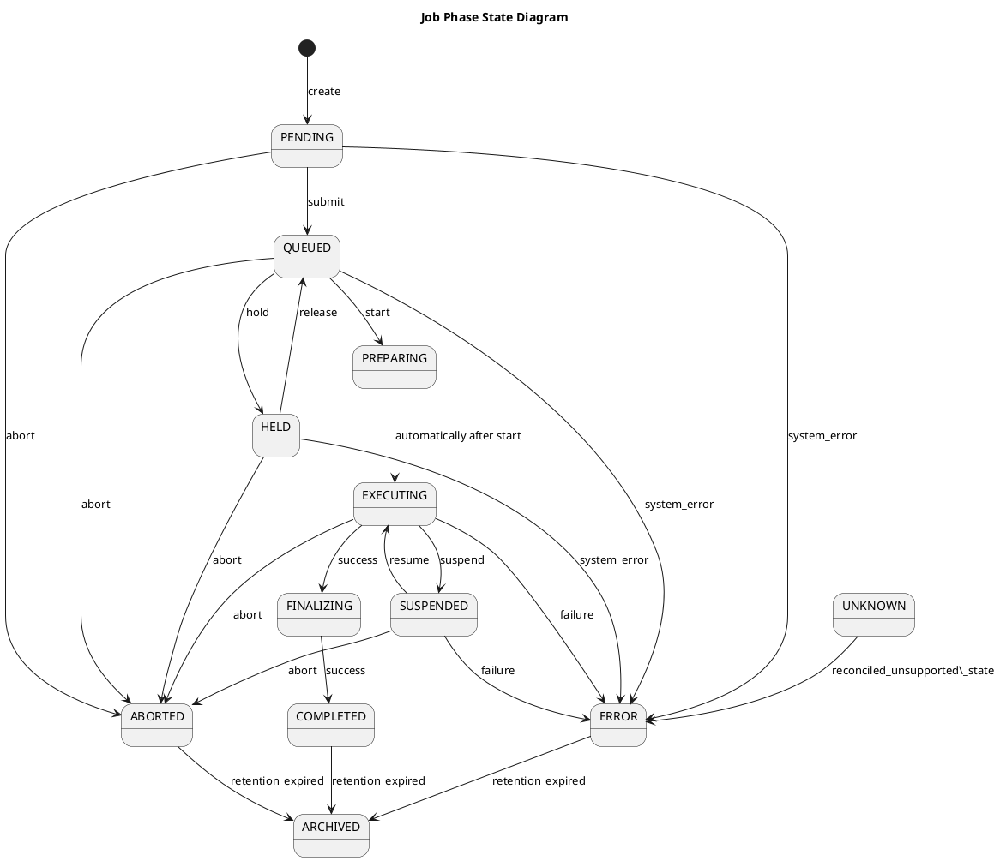

Runtime Environment
===================

 * not able to access the external internet, this is a security measure that means that all inputs and outputs are accessed via files that are mounted into the container, and all software is included in the container image. This means that the execution environment is decoupled from the underlying infrastructure, and allows for a more secure and controlled execution environment.
 * inputs are mounted a directory /inputs and outputs are mounted at /outputs
   * it is the responsibility of the system to ensure that the correct files are mounted into the container, and that the outputs are correctly collected from the container after execution.
   * it follows that the there needs to be a DataLocator concept that describes the location of the input and output files, and this is used to ensure that the correct files are mounted into the container.
 * the container image is expected to include all the software necessary to execute the task, and it needs to have been registered with the SoftwareMetadataService and stored in and approved container registry. The container image is expected to be a standard OCI compliant image, and it is the responsibility of the system to ensure that the correct image is used for the execution of the task.
 * The container process runs as an anonymous non-privileged user, and the system is responsible for ensuring that the correct permissions are set on the input and output files to allow the container process to access them. This is a security measure that ensures that the container process does not have access to any files that it should not have access to, and it also allows for a more secure execution environment.

## Future versions

Possible future versions of the runtime environment could include additional features such as:

* /scratch directory - usable for temporary files that are not expected to be mounted into the container, and are not expected to be collected after execution. This allows for a more efficient use of storage, as temporary files can be stored in a location that is optimised for performance, and do not need to be collected after execution. In addition for certain container types that expose access to another execution environment - e.g. a slurm cluster - could guarantee that the /scratch directory is on a shared file system that is accessible to all the nodes in the cluster, and this would allow for the execution of tasks that require access to a shared file system.
* /home directory - usable for storing user-specific configuration files and data that needs to be persisted across executions. 
* named volumes - usable for storing data that needs to be shared between multiple containers, or that needs to be persisted across executions. This allows for a more flexible and extensible system, as it allows for the sharing of data between multiple containers, and it also allows for the persistence of data across executions. The main disadvantage of using named volumes is that it requires additional configuration and management, as the system needs to ensure that the correct volumes are created and managed, and that the correct data is stored in the correct volumes.

## State Diagram

